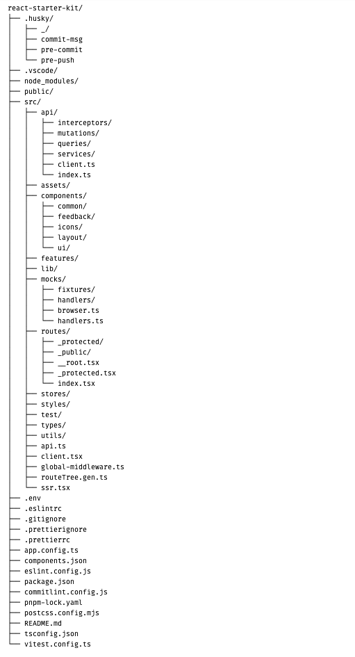

# React + TanStack Starter Project Setup

Welcome to the **Formula Zone**

### Tech stack

- **React**
- **TypeScript**
- **TanStack Router**
- **TanStack Query**
- **Zustand**
- **Tailwind CSS**
- **Shadcn UI**
- **Axios**
- **Vitest**

## 1. Prerequisites

Make sure you have the following tools installed

- **Node.js** ≥ 18.x
- **pnpm** ≥ 8.x — [Install pnpm](https://pnpm.io/installation)
- **Git** ≥ 2.x

## 2. Getting Started

Clone the repository and install dependencies

```bash
git clone https://github.com/nimesha-edirisinghe/react-starter-kit.git
cd react-starter-kit
pnpm install
```

## 3. Development

To start the local dev server

```bash
pnpm dev
```

Then open [http://localhost:3000](http://localhost:3000) in your browser.

## 4. Demo Login Credentials

To sign in to the application during development, use the following credentials

Email: `admin@gmail.com`
Password: `1Qaz2wsx#`

## 5. Testing

Run unit tests using [Vitest](https://vitest.dev/)

```bash
pnpm test
```

## 6. Useful Commands

| Command             | Description                          |
| ------------------- | ------------------------------------ |
| `pnpm dev`          | Start dev server                     |
| `pnpm build`        | Build for production                 |
| `pnpm lint`         | Run ESLint checks                    |
| `pnpm format`       | Run Prettier formatting              |
| `pnpm test`         | Run unit tests                       |
| `pnpm prepare`      | Setup Husky git hooks                |

---

# Folder Structure



# Explanation of Your Folder Structure

#### Root-Level Config Files

- `.eslintrc`, `.prettierrc`, `eslint.config.js` : Code linting and formatting
- `tsconfig.json` : TypeScript configuration
- `postcss.config.mjs` : PostCSS config
- `vite.config.ts`: Vite setup (used under TanStack Start)
- `vitest.config.ts` : Configuration file for [Vitest](https://vitest.dev/)
- `.env` : Environment variable file to define app configuration values (e.g., API keys, secrets, URLs) outside of source code

#### 📁`.husky/` 📁`.vscode/`

>

- `.husky/` : Git hooks directory used to automate tasks like running linters or tests before commits or pushes.
  - `pre-commit` – Runs `lint-staged` to auto-format and lint staged files.
  - `pre-push` – Executes tests (`pnpm test`) to ensure code quality before pushing.
  - `commit-msg` – Validates commit message format using Commitlint to enforce conventional commits.
  - `_/` – Internal Husky scripts (auto-managed by Husky, do not edit manually).
- `.vscode/` : Project-specific settings and extensions

  - `settings.json` – Configures formatters, disables search/watch for generated files like `routeTree.gen.ts`, and enforces consistent dev environment.
  - `extensions.json` – Recommends VS Code extensions like ESLint, Prettier, and Tailwind IntelliSense for collaborators.

## `src/` - Main Application Code

#### 📁 `api/`

>

- `interceptors/` : Axios request/response interceptors for authentication, error handling
- `mutations/` : TanStack Query mutation definitions for data modification
- `queries/` : TanStack Query query definitions for data fetching
- `services/` : API service functions and endpoint definitions
- `client.ts` : Axios client configuration
- `index.ts` : API exports and barrel file

#### 📁 `components/`

>

- `common/` - Reusable UI components used across the app
- `feedback/` - A dedicated folder for **user feedback UI**, ( Error boundaries, 404 Not Found pages,API-specific error states )
- `icons/` - Custom icon components
- `layout/` - Layout wrapper components (navbar, sidebars, etc.)
- `ui/` - Shadcn/ui components (buttons, forms, input, etc.)

#### 📁 `features/`

>

- Feature-based organization where each feature contains its own components, hooks, and logic

#### 📁 `lib/`

>

- Utility functions and helpers

#### 📁 `mocks/`

>

- `fixtures/` - Static data for mocks
- `handlers/` - Domain-specific MSW handlers
- `handlers.ts` - Combines all handlers
- `browser.ts` - Sets up the MSW service worker in dev

#### 📁 `routes/`

>

- `_protected/` - Protected routes requiring authentication
- `_public/` - Public routes accessible without authentication
- `__root.tsx` - Root route component
- `_protected.tsx` - Protected route layout
- `index.tsx` - This is the default route shown when someone visits your domain root (e.g., `http://localhost:3000/` or `yourdomain.com/`)

#### 📁 `stores/`

- Zustand store definitions for global state management

#### 📁 `styles/`

- Global CSS and Tailwind configurations

#### 📁 `test/`

- Test utilities and setup files

#### 📁 `utils/`

- General utility functions and helpers

---

### Key Design Decisions

##### 1. Feature-based organization (features/)

Each feature is self-contained with its own components, hooks, and logics.

##### 2. Separation of concerns

Clear boundaries between API, UI, state, and routing

##### 3. Type safety

Dedicated types directory for TypeScript definitions

##### 4. Developer experience

Husky for git hooks, ESLint/Prettier for code quality

##### 5. Repository pattern API Layer (api/)


##### 6. Layered Architecture Pattern

Each layer only communicates with adjacent layers


##### 7. Multi-Store State Pattern with Zustand


##### 8. Advanced Routing with Tanstack Router

Route Features

- Type-safe navigation - TypeScript knows all your routes
- Automatic code splitting - Each route is lazy-loaded
- Search params validation - Type-safe URL parameters
- Route-level data loading - Preload data before rendering
- Authentication guards - Protected routes with redirects

##### 9. Route Guards & Middleware Pattern


##### 10. Authentication Implementation with Zustand Persistence

The authentication system is implemented using Zustand with persistence to handle user sessions across page refreshes.

###### Core Features

- Persistent authentication state
- Protected route handling
- Smooth page refresh experience
- Loading state management

###### Components

1. **Auth Store**

   - Manages user state
   - Handles persistence
   - Controls authentication flow

2. **Auth Guard**

   - Protects routes
   - Manages redirects
   - Handles loading states

3. **Route Protection**
   - Route-level security
   - Authentication checks
   - Guard integration

###### Login flow


---

## Extending the Application: Features, Pages, and Services

### Step-by-Step: Add a New Feature in a TanStack Start App

##### 1. Step 1: Add the Route

If it's protected route feature, add like this
📁 src/routes/\_protected/tasks/

- `index.tsx` - Create the page UI for the route /tasks
- `route.tsx`


If it's public route feature, add like this
📁 src/routes/\_public/tasks/


##### Step 2: Create the Feature folder


##### Step 3: Define the API Layer


##### Step 4: Mock the API for Local Dev


##### Step 5: Create e2e, integration and unite test files for the new feature called Task.

---

## 📹 Video Walkthrough

Check out the quick video walkthrough of the application architecture, folder structure, and tech stack overview:

👉 [Watch the Loom Video](https://www.loom.com/share/e737d80e08d54390bd0eca12c9267e0c?sid=4430ce17-9ec4-434c-8573-f873dcc63525)

This video covers:

- Architecture Principles
- Project Structure Overview
- API layer and routing logic
- Feature-based folder structure
- State management with Zustand
- UI design with Shadcn and TailwindCSS
- Mocking with MSW
